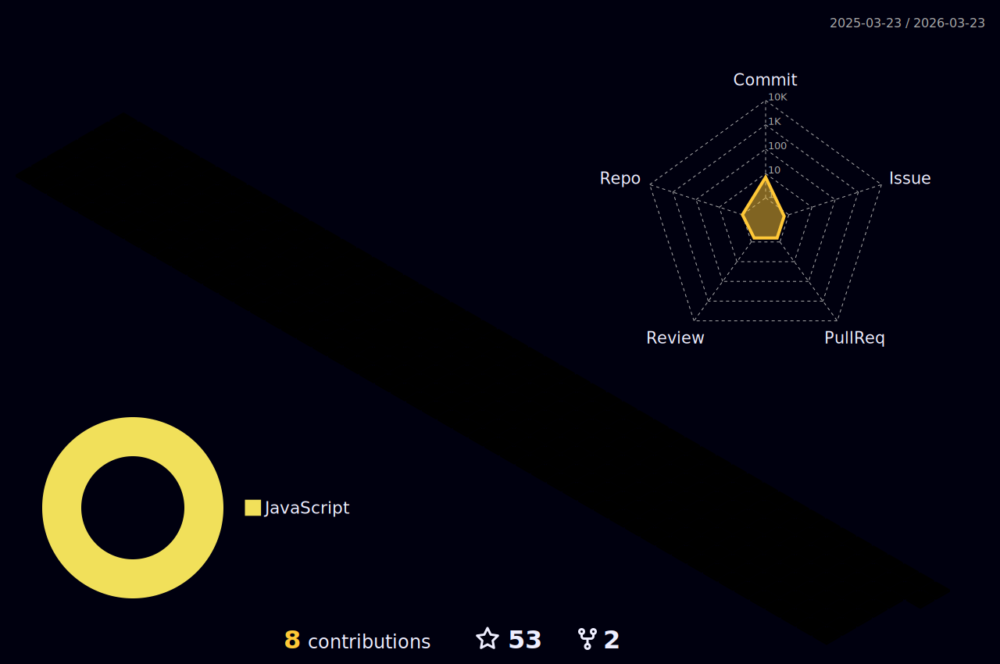

  
  

   

   
  

    
      <ul>
        <li>
          🔭 I'm currently working on
          <a href="https://github.com/Ronnie018/search_in_media">SIM project</a>
        </li>
        <li>🌱 I'm currently learning <strong>C and microservices</strong></li>
        <li>💬 Ask me about <strong>React and Python stuff</strong></li>
        <li>You can reach me on <strong>rondinelibrt18@gmail.com</strong></li>
      </ul>
    
  

   
  <h3 align="left">Connect with me:</h3>
  

    
    
    
  

  <h3 align="left">Languages and Tools I went through:</h3>

  

    
    
    
    
    
    
    
    
    
    
    
    
    
    
    
    
    
    
    
    
    
    
  

   

  

    

      <h3>Statistics</h3>
    

  

    

      
    

  

    
  

